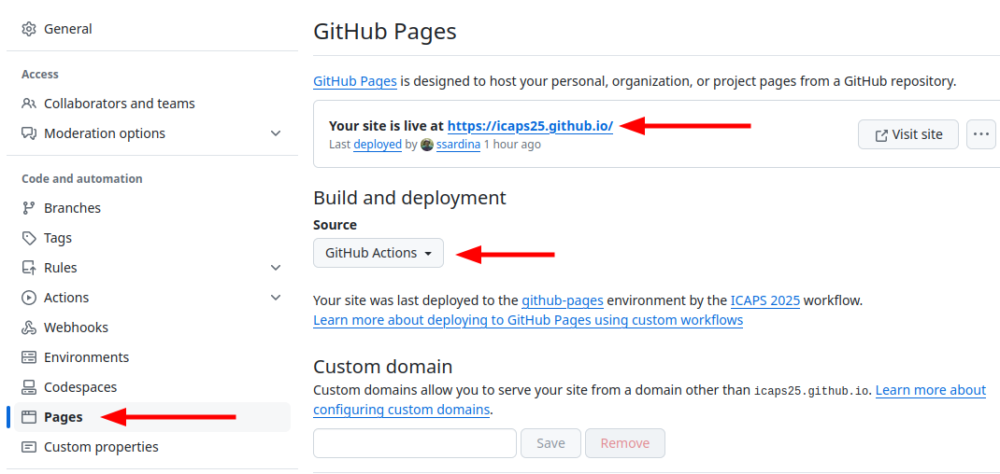

# icaps2025.github.io

Website for the ICAPS 2025 conference held in Melbourne, Australia - November 9-14, 2025.

## Framework: Hugo + Deployment to GH-pages via GH Actions

The site is built with [HUGO](https://gohugo.io) framework for automated generation of _static_ web content. To develop the site, [install hugo](https://gohugo.io/getting-started/installing) so you can test it locally before publishing.

All development of the website happens in this repo. Then, when pushed to branch `main`, a GH Actions workflow:

1. first _builds_ the static pages (by running `hugo`); and then
2. _deploys_ the site into [github-pages](https://docs.github.com/en/pages/getting-started-with-github-pages/configuring-a-publishing-source-for-your-github-pages-site).

Note that by doing this, the actual produced static pages do lot live in this repo (or any repo!): they are directly published via GitHub Actions to github-pages. So, you need to set-up the _Build and deployment_ mode of this repo as follows:



### Tools used

- [HUGO](https://gohugo.io) framework for production of static web pages.
- [Weather Widget](https://weatherwidget.org/): for the weather widget at the conference location.

## Testing changes

The site is built with [HUGO](https://gohugo.io) framework for automated generation of static web content.

If you have [hugo installed](https://gohugo.io/getting-started/installing) on your system, you can test your changes by running:

```shell
$ hugo server
```

in the *website root*.

This will start a webserver on http://localhost:1313. Static pages will be under `public/` (not tracked by git), that could also be deployed in any other web server if needed. To build the static pages without the local server:

```shell
$ hugo -t mainroad -d <FOLDER TO BUILD STATIC PAGES>
```

If `-d` is not given, it will be produced in folder `public/`.